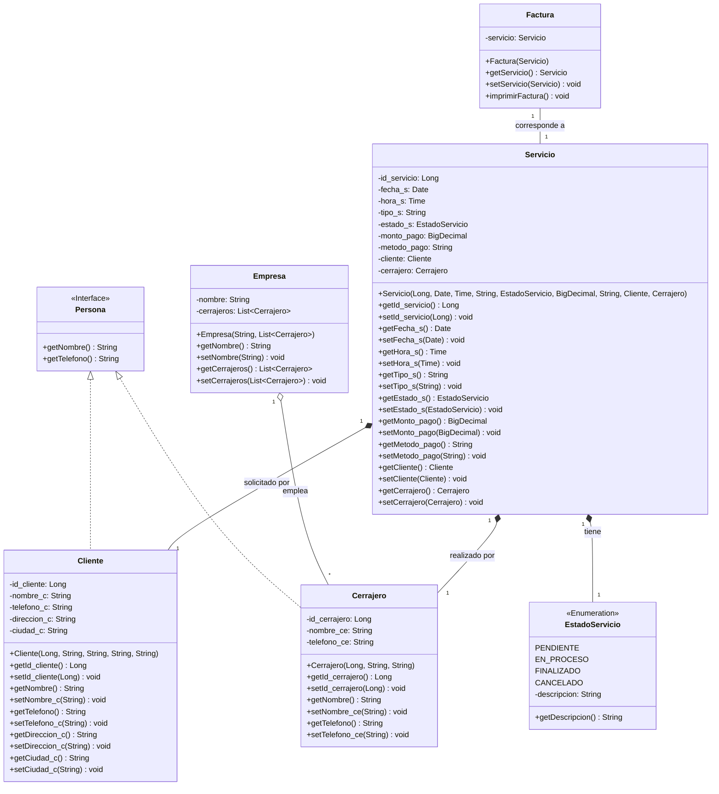

```mermaid
classDiagram
    class Persona {
        <<Interface>>
        %% --- Métodos ---
        +getNombre() String
        +getTelefono() String
    }

    class Cliente {
        %% --- Atributos ---
        -id_cliente: Long
        -nombre_c: String
        -telefono_c: String
        -direccion_c: String
        -ciudad_c: String
        
        %% --- Constructor ---
        +Cliente(Long, String, String, String, String)

        %% --- Métodos (Getters y Setters) ---
        +getId_cliente() Long
        +setId_cliente(Long) void
        +getNombre() String
        +setNombre_c(String) void
        +getTelefono() String
        +setTelefono_c(String) void
        +getDireccion_c() String
        +setDireccion_c(String) void
        +getCiudad_c() String
        +setCiudad_c(String) void
    }

    class Cerrajero {
        %% --- Atributos ---
        -id_cerrajero: Long
        -nombre_ce: String
        -telefono_ce: String

        %% --- Constructor ---
        +Cerrajero(Long, String, String)

        %% --- Métodos (Getters y Setters) ---
        +getId_cerrajero() Long
        +setId_cerrajero(Long) void
        +getNombre() String
        +setNombre_ce(String) void
        +getTelefono() String
        +setTelefono_ce(String) void
    }

    class Empresa {
        %% --- Atributos ---
        -nombre: String
        -cerrajeros: List~Cerrajero~

        %% --- Constructor ---
        +Empresa(String, List~Cerrajero~)

        %% --- Métodos (Getters y Setters) ---
        +getNombre() String
        +setNombre(String) void
        +getCerrajeros() List~Cerrajero~
        +setCerrajeros(List~Cerrajero~) void
    }

    class Servicio {
        %% --- Atributos ---
        -id_servicio: Long
        -fecha_s: Date
        -hora_s: Time
        -tipo_s: String
        -estado_s: EstadoServicio
        -monto_pago: BigDecimal
        -metodo_pago: String
        -cliente: Cliente
        -cerrajero: Cerrajero

        %% --- Constructor ---
        +Servicio(Long, Date, Time, String, EstadoServicio, BigDecimal, String, Cliente, Cerrajero)

        %% --- Métodos (Getters y Setters) ---
        +getId_servicio() Long
        +setId_servicio(Long) void
        +getFecha_s() Date
        +setFecha_s(Date) void
        +getHora_s() Time
        +setHora_s(Time) void
        +getTipo_s() String
        +setTipo_s(String) void
        +getEstado_s() EstadoServicio
        +setEstado_s(EstadoServicio) void
        +getMonto_pago() BigDecimal
        +setMonto_pago(BigDecimal) void
        +getMetodo_pago() String
        +setMetodo_pago(String) void
        +getCliente() Cliente
        +setCliente(Cliente) void
        +getCerrajero() Cerrajero
        +setCerrajero(Cerrajero) void
    }

    class EstadoServicio {
        <<Enumeration>>
        %% --- Valores ---
        PENDIENTE
        EN_PROCESO
        FINALIZADO
        CANCELADO

        %% --- Atributo ---
        -descripcion: String

        %% --- Método ---
        +getDescripcion() String
    }
    
    class Factura {
      %% --- Atributo ---
      -servicio: Servicio

      %% --- Constructor ---
      +Factura(Servicio)

      %% --- Métodos (Getters, Setters y otros) ---
      +getServicio() Servicio
      +setServicio(Servicio) void
      +imprimirFactura() void
    }

    %% --- Relaciones ---
    Persona <|.. Cliente
    Persona <|.. Cerrajero
    Empresa "1" o-- "*" Cerrajero : emplea
    Servicio "1" *-- "1" Cliente : solicitado por
    Servicio "1" *-- "1" Cerrajero : realizado por
    Servicio "1" *-- "1" EstadoServicio : tiene
    Factura "1" -- "1" Servicio : corresponde a
```
