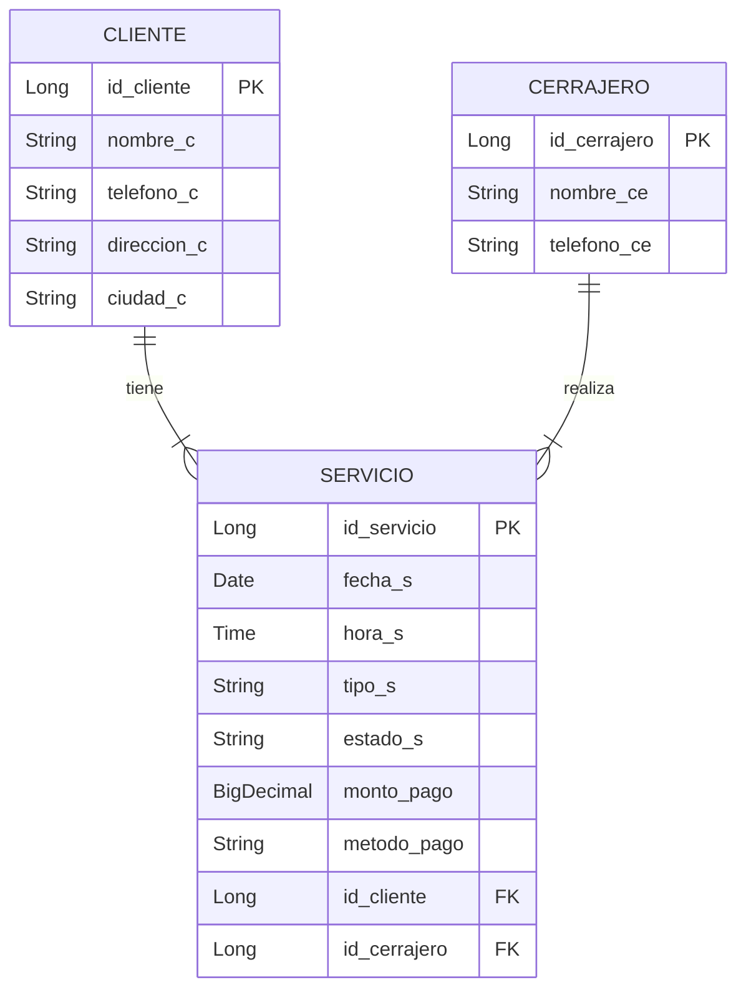

```mermaid
erDiagram
    CLIENTE {
        Long id_cliente PK
        String nombre_c
        String telefono_c
        String direccion_c
        String ciudad_c
    }

    CERRAJERO {
        Long id_cerrajero PK
        String nombre_ce
        String telefono_ce
    }

    SERVICIO {
        Long id_servicio PK
        Date fecha_s
        Time hora_s
        String tipo_s
        String estado_s
        BigDecimal monto_pago
        String metodo_pago
        Long id_cliente FK
        Long id_cerrajero FK
    }

    CLIENTE ||--|{ SERVICIO : "tiene"
    CERRAJERO ||--|{ SERVICIO : "realiza"

```
